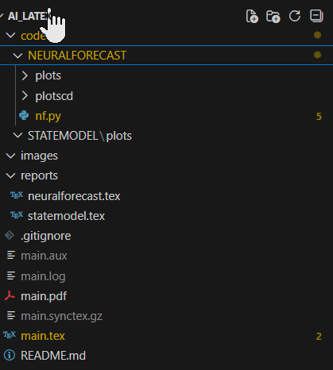

# AI_Latex - AI 時序分析與 LaTeX 文件專案

## 📋 專案簡介
本專案整合時序分析模型（StateModel、NeuralForecast）與 LaTeX 學術文件撰寫，提供完整的研究流程範例。

## 🗂️ 目錄結構
```
AI_Latex/
├── main.tex                    # LaTeX 主檔案
├── reports/                    # 分析報告子檔案
│   ├── statemodel.tex         # StateModel 分析
│   └── neuralforecast.tex     # NeuralForecast 分析
├── code/                       # AI 程式與輸出
│   ├── STATEMODEL/
│   │   └── plots/             # StateModel 圖表
│   └── NEURALFORECAST/
│       └── plots/             # NeuralForecast 圖表
└── images/                     # README 說明圖片
    └── project_structure.png
```

## 🚀 功能特色
- ✅ 支援中文 LaTeX 文件（XeLaTeX 編譯）
- ✅ 時序分析模型整合
- ✅ 自動化圖表與表格生成
- ✅ 模組化報告結構

## 📊 專案架構圖


## 🛠️ 環境需求
- **TeX Live 2025**（含 XeLaTeX）
- **VS Code** + LaTeX Workshop 擴充套件
- **Python 3.8+**（用於 AI 分析程式）

## 📖 使用說明

### 1. 編譯 LaTeX 文件
```bash
# 在 VS Code 中開啟 main.tex，按 Ctrl+Alt+B 編譯
# 或使用指令：
xelatex main.tex
```

### 2. 運行 AI 分析
```bash
# StateModel 分析
cd code/STATEMODEL
python statemodel_analysis.py

# NeuralForecast 分析
cd code/NEURALFORECAST
python neuralforecast_analysis.py
```

### 3. 更新圖表
- 將分析產生的圖片放入對應的 `plots/` 資料夾
- 重新編譯 `main.tex` 即可自動引用

## 📝 範例輸出
### StateModel 殘差分析


### NeuralForecast 預測比對


## 🔧 設定說明
### LaTeX 編譯設定（settings.json）
```json
{
    "latex-workshop.latex.tools": [{
        "name": "xelatex",
        "command": "xelatex",
        "args": ["-synctex=1", "-interaction=nonstopmode", "%DOC%"]
    }],
    "latex-workshop.latex.recipe.default": "xelatex"
}
```

## 📚 參考資料
- [LaTeX Workshop 官方文件](https://github.com/James-Yu/LaTeX-Workshop)
- [NeuralForecast 官方文件](https://nixtla.github.io/neuralforecast/)
- [StateSpace Models 教學](https://www.statsmodels.org/stable/statespace.html)

## 👤 作者
Po-Yin Chang

## 📄 授權
MIT License
```

---

### **2. 建立專案架構圖**

在 `images/` 資料夾放入圖片（兩種方式）：

**方式 A：手動截圖**
1. 建立資料夾：
````powershell
mkdir images